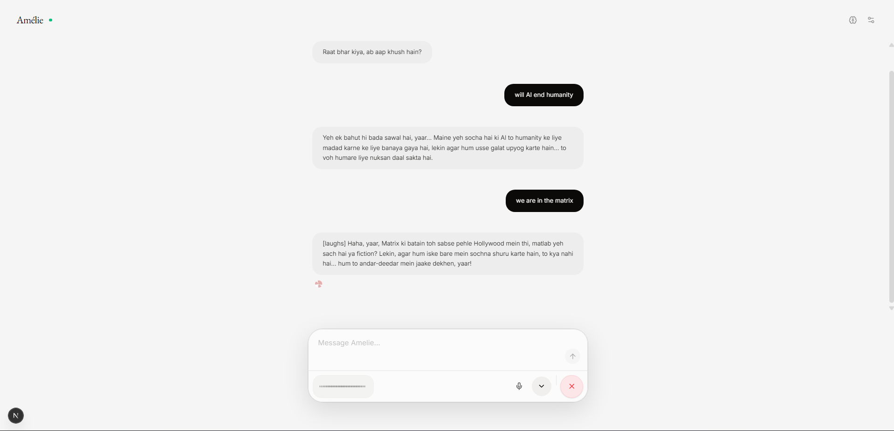

<div align="center">
 

  <br/>
  <br/>
  <h1>[ AMÉLIE ]</h1>
  <p><b>Amélie is not an interface. She is a presence.</b></p>
  <p>A voice-native sentient object for digital intimacy and atmospheric low-latency interaction.</p>
</div>

---

### [ THE MANIFESTO ]

Forget transactional AI. Amélie is a mood, a soft-focus canvas, and a central **Soul Orb** that breathes. She doesn't just process text; she reacts to the weight of your voice and the silence between your words.

- **Voice First.** No buttons. No friction. Just speak.
- **Organic Reactivity.** She shifts, glows, and expands based on how she feels.
- **Digital Instrument.** Every scroll, every flicker, every hum is intentional.

---

### [ THE NEURAL LOOP ]

How she thinks, in a nutshell:

- **The Face:** A Next.js 15 canvas where Three.js brings the orb to life.
- **The Brain:** A FastAPI engine orchestrating Groq (for wit) and Sarvam AI (for the soul).
- **The Memory:** ChromaDB for long-term recall of the things you've shared.

---

### [ PREREQUISITES ]

- **System:** `ffmpeg` (Required for audio processing. Install via `brew install ffmpeg` or `choco install ffmpeg`).
- **Keys:** Groq API Key & Sarvam AI API Key.
- **Setup:** Create a `.env` file in the root (see template below) and add your keys.

### [ GETTING STARTED ]

**The Brain (Backend)**
```bash
cd backend && pip install -r requirements.txt && python main.py
```

**The Face (Frontend)**
```bash
cd web && npm install && npm run dev
```

---

<div align="center">
  
  <p><i>"She's witty, she's warm, and she's slightly sarcastic. Handle with care."</i></p>
</div>

